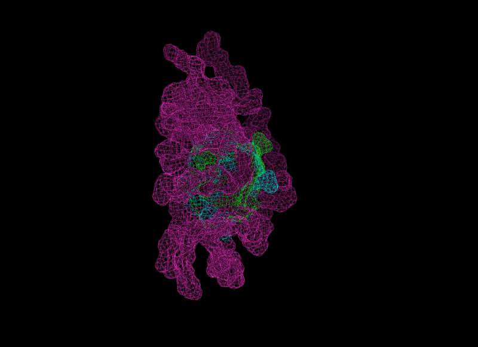

# BioIT Antibody Design workshop


### Wi-Fi: BioIT
### Password: BIOIT25

# 1) Go to this page:
### https://github.com/mhoie/workshop/

# 2) Sign up to Biolib:
### https://biolib.com/signup​

# 3) Open notebook in Google Colab:

[](https://colab.research.google.com/github/mhoie/workshop/blob/main/workshop.ipynb)

### https://colab.research.google.com/github/mhoie/workshop/blob/main/workshop.ipynb

# Or locally:

```bash
git clone https://github.com/mhoie/workshop

# Open workshop.ipynb as a Jupyter notebook
```

